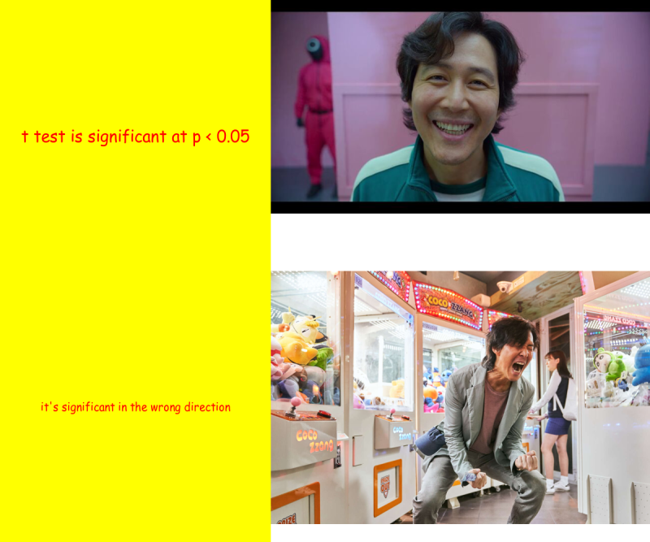

# Kia Ora

This is the website that statistic student from **University of Auckland** made for the first time. I might be unexperienced and made a lot of mistakes but hope I get to learn a lot from stats 220.

## This is *meme* i made for the first time!



## These are the codes I used to make this *meme*
```
install.packages("magick")
library(magick)

#square one
happy_text <- image_blank(width = 500, height = 500, color = "#FFFF00") %>%
  image_annotate(text = "t test is significant at p < 0.05",
                 color = "#FF0000",
                 size = 30,
                 font =  "Comic Sans MS",
                 gravity = "center")
#square two
happy_face <- image_read("https://static.wikia.nocookie.net/6b3c6352-9879-47f6-a16a-06f932cd1ea4/scale-to-width/755") %>%
  image_scale(700)

#square three
confused_text <- image_blank(width = 500, height = 500, color = "#FFFF00") %>%
  image_annotate(text = "it's significant in the wrong direction",
                 color = "#FF0000",
                 size = 20,
                 font =  "Comic Sans MS",
                 gravity = "center")

#square four 
confused_face <- image_read("https://assets3.thrillist.com/v1/image/3011647/1584x1056/crop;webp=auto;jpeg_quality=60;progressive.jpg") %>%
  image_scale(700)

#making each row
emotion_vector <- c(happy_text,happy_face)
top_row <- image_append(emotion_vector)

bottom_row <- image_append(c(confused_text,confused_face))

#making them in one
meme <- c(top_row, bottom_row) %>%
  image_append(stack = TRUE) %>%
  image_scale(800)
meme
image_write(meme, "my_meme.png")

```

## reference of image 
- ([happy_face](https://static.wikia.nocookie.net/6b3c6352-9879-47f6-a16a-06f932cd1ea4/scale-to-width/755))
- ([confused_face](https://assets3.thrillist.com/v1/image/3011647/1584x1056/crop;webp=auto;jpeg_quality=60;progressive.jpg))

## This is the referenced *meme* 
-

## inspiration for the *meme* is...

1. I have been enjoying watching squaid game recently
2. I found meme about stats that really got me
3. I was sure that other people would empathize with the meme
4. So I took the sentence from the original meme and used in my meme image
